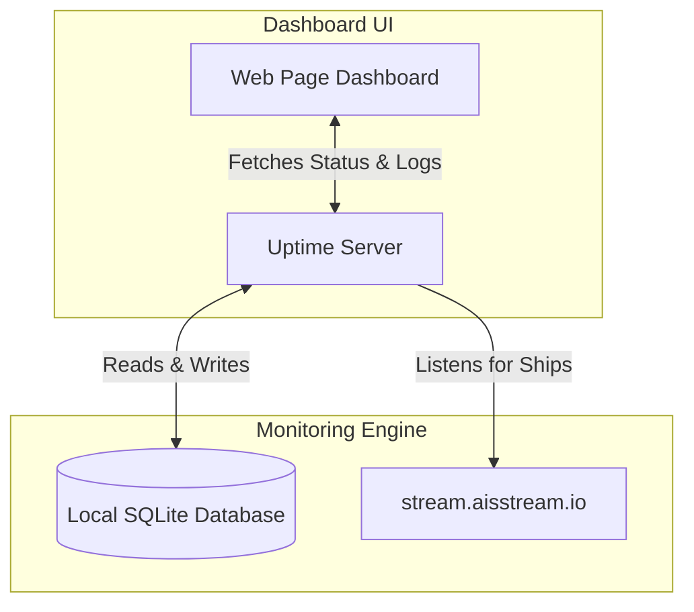

# AISStream Uptime Monitor

A lightweight, reliable tool to monitor the live Automatic Identification System (AIS) marine shipping stream (`stream.aisstream.io`). It keeps track of connection health, detects silent stream outages (when connected but no ships are reporting), logs downtime history, and provides a beautiful dashboard to view the status at a glance.

---

## What is this and why is it needed? (Plain English)

The live shipping stream (`stream.aisstream.io`) broadcasts real-time ship locations worldwide over WebSockets. If this stream goes down, apps relying on ship tracking data will fail silently. 

This Uptime Monitor connects to the stream and acts as a "heartbeat" detector. If the stream stops sending data, gets disconnected, or experiences authentication errors, this monitor immediately detects the failure, logs the incident, and displays the status on a web dashboard.

---

## Key Features

- **Real-Time Heartbeat Tracking**: Constantly listens to vessel position updates.
- **Intelligent Status Detection**: Automatically classifies the system into five states (Pending, Operational, Silent Failure, Login Error, or Disconnected).
- **Flicker Protection**: If the internet drops for just a few seconds and comes back, it won't clutter your logs with tiny, fragmented errors. It merges them into one single continuous incident.
- **Privacy-First Logging**: Automatically scrubs your secret API keys from all public logs to keep your credentials secure.
- **Live Developer Dashboard**: A clean web interface showing a 24-hour visual status bar and developer diagnostic logs.
- **Docker Ready**: Ready to deploy out-of-the-box in a self-healing container.

---

## How It Works Under the Hood



The application is split into two parts:
1. **The Daemon (Monitoring Engine)**: Runs in the background, listening to the AIS stream. If a connection failure occurs, it logs it in a local database file (`uptime.db`).
2. **The Dashboard**: A single web page you open in your browser that fetches data from the Monitoring Engine and displays it using easy-to-read cards, a timeline grid, and charts.

---

## Configuration Settings

You can customize how the monitor behaves by setting these variables in a `.env` file or in your environment:

| Setting | Type | What it does |
| :--- | :--- | :--- |
| `AISSTREAM_API_KEY` | Text | **Required.** Your secret key from aisstream.io. |
| `PORT` | Number | The port number to view the web dashboard (default: `3000`). |
| `DEV` | True/False | Set to `true` to show developer simulation tools on the dashboard. |
| `SILENCE_TIMEOUT_SECONDS` | Number | How long to wait (in seconds) without any ship updates before declaring a "Silent Failure" (default: `15`). |
| `API_RATE_LIMIT_RPM` | Number | Prevents overload by limiting how many requests a browser can make per minute (default: `60`). |

---

## Quick Start (Run Locally)

### 1. Prerequisites
- **Node.js** (v18 or higher) installed on your computer.

### 2. Setup
Download dependencies:
```bash
npm install
```

### 3. Configure
Create a file named `.env` in the root folder and add your API key:
```env
AISSTREAM_API_KEY=your_key_here
PORT=3000
DEV=true
```

### 4. Run the App
Start the server:
```bash
npm start
```
Now, open **[http://localhost:3000](http://localhost:3000)** in your web browser to view the dashboard!

---

## Docker Deployment (Production)

If you use Docker, you can run the app in a single command. It maps the database file to a persistent folder so logs aren't lost when the container stops.

```bash
# Start the monitor
docker-compose up -d

# Check live logs
docker-compose logs -f

# Stop the monitor
docker-compose down
```

---

## Technical Details (For Developers & API Integrations)

All API routes return JSON data and are prefixed with `/api/v1/`.

### 1. Health Check (`GET /api/v1/health`)
A fast check to confirm the server is running.
- **Response**: `{"status": "ok"}`

### 2. Live Status (`GET /api/v1/status`)
Returns the current state, last check timestamps, and a rolling 24-hour status grid.
- **Query Parameter**: `simple=true` skips historical calculation and database queries to return instant connection state.
- **Example Response (Standard)**:
  ```json
  {
    "state": "Up",
    "lastChecked": "2026-06-17T21:30:15.000Z",
    "lastMessageReceived": "2026-06-17T21:30:14.000Z",
    "history": [
      { "timestamp": "2026-06-17T21:00:00.000Z", "state": "Up" },
      { "timestamp": "2026-06-17T21:30:00.000Z", "state": "Silent Failure" }
    ],
    "devMode": false,
    "simulated": false,
    "silenceTimeout": 15000
  }
  ```

### 3. Outage Incidents (`GET /api/v1/incidents`)
Returns a list of all current and past outages from the SQLite database.
- **Example Response**:
  ```json
  [
    {
      "id": 12,
      "start_time": "2026-06-17T19:00:00.000Z",
      "end_time": "2026-06-17T19:05:30.000Z",
      "outage_type": "Down",
      "details": "{\"summary\":\"Connection dropped: ECONNREFUSED\",\"errors\":[]}"
    }
  ]
  ```

### 4. Console Logs (`GET /api/v1/logs` - Dev Mode Only)
Fetches the 50 most recent console log messages stored in memory. Returns `403 Forbidden` in production.

### 5. Outage Simulation (`POST /api/v1/test/simulate` - Dev Mode Only)
Fakes an outage to test client response. Expects JSON body with a `"state"` field (e.g. `{"state": "Down"}`).

### 6. Resume Live Monitor (`POST /api/v1/test/resume` - Dev Mode Only)
Clears simulation overrides and reconnects to the live WebSocket stream.
